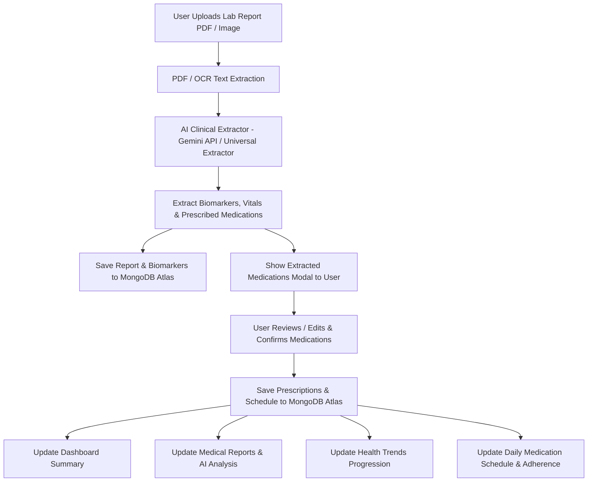

# 🏥 MedGuardian AI - Clinical Health Intelligence & Emergency Dispatch Portal

[](https://react.dev/)
[](https://vitejs.dev/)
[](https://nodejs.org/)
[](https://www.mongodb.com/cloud/atlas)
[](https://tailwindcss.com/)
[](LICENSE)

**MedGuardian AI** is a state-of-the-art, full-stack clinical health intelligence web application designed to transform complex lab report PDFs and doctor prescriptions into plain-language diagnostic summaries, actionable health metrics, dynamic medication adherence schedules, historical biomarker progression trends, and 1-click emergency SOS dispatching.

---

## 🌐 Live Deployments

- 📱 **Frontend Web Application (Vercel)**: [https://medical-ai-tan.vercel.app](https://medical-ai-tan.vercel.app)
- ⚙️ **Backend REST API (Render)**: [https://medicalai-backend-5ycw.onrender.com](https://medicalai-backend-5ycw.onrender.com)
- 📦 **GitHub Repository**: [https://github.com/samriddhi-1208/MedicalAI.git](https://github.com/samriddhi-1208/MedicalAI.git)

---

## 🌟 Key Features Overview

### 📄 1. Dynamic Medical Report & Prescription Extraction (OCR + Gemini AI)
- **Live PDF & Image Parsing**: Extracts clinical document text instantly using `pdf-parse` and client/server-side `Tesseract.js` OCR.
- **AI Medical Extractor**: Utilizes Google Gemini API (or built-in Universal Dynamic Clinical Extractor fallback) to parse lab parameters, reference ranges, status flags (Normal/High/Low/Critical), vitals, and prescribed medications.
- **Interactive Verification Modal**: Shows users pre-populated extracted medications with exact dosage, timing, frequency, and meal relations before confirming and saving to their schedule.

### 🔗 2. Unified Multi-Report Architecture & Duplicate Prevention
- **Single Source of Truth**: Uploading a medical report once automatically updates all system sections—Dashboard, Medical Reports, Medications, and Health Trends.
- **SHA-256 Content Hash Duplicate Check**: Prevents duplicate database entries when uploading identical files while preserving history when uploading updated reports.
- **Multi-Document Switcher**: Switch seamlessly between any historical lab report (Report #1, Report #2, etc.) on the AI Analysis page via a built-in document selector.

### 💊 3. Smart Medication Schedule & Adherence Tracking
- **Automated Prescription Management**: Extracted prescribed medications populate a daily schedule segmented into Morning, Afternoon, Evening, and Night time slots.
- **Adherence Tracking**: One-tap "Mark as Taken" tracking calculates today's adherence rate percentage.
- **Refill Alert Thresholds**: Tracks remaining tablet supplies and triggers refill warnings when stock drops below threshold.
- **Duration Auto-Expiration**: Automatically marks medications as completed once treatment duration expires.

### 📈 4. Historical Health Trends & Biomarker Progression
- **Biomarker Progression Tracking**: Plots historical values for key parameters (Hemoglobin, WBC Count, Fasting Glucose, Serum Creatinine, TSH, ALT, AST, etc.) across multiple uploaded lab reports.
- **Interactive Recharts Visualization**: Displays visual progress graphs with clinical normal ranges to help users track health over time.

### 🗺️ 5. 24/7 OpenStreetMap Real-Time Hospital Finder
- **Real-Time Proximity Engine**: Locates nearby hospitals, clinics, emergency rooms, and pharmacies using OpenStreetMap Nominatim reverse-geocoding.
- **Dual Location Modes**: Supports both instant browser GPS location locking and manual location search (e.g. City, State).
- **Interactive Map & Emergency Shortcuts**: View hospital distance in km, operating hours, direct phone call shortcuts, and Google Maps driving directions.

### 🚨 6. 1-Tap Emergency SOS Dispatch System
- **1-Tap Pulsing SOS Dispatch**: Sends immediate emergency alerts with current GPS coordinates.
- **National Emergency Hotline**: 1-Tap direct call button to national ambulance services (`108`).
- **Trusted Emergency Contacts**: Manage primary and secondary emergency contacts with instant phone dialing.

### 🌍 7. Complete Multi-Lingual Localization (100% Site-Wide)
- **Dynamic Language Switcher**: Supports **English (EN)**, **Hindi (HI - हिंदी)**, and **Gujarati (GU - ગુજરાતી)**.
- **100% Component Translation**: Translates headers, sidebars, dashboard actions, medical report cards, medication schedules, hospital search results, and emergency alerts.

### 📱 8. Native Mobile-Responsive SaaS Design
- **Mobile-First Touch UI**: Built with dynamic bottom navigation, responsive form layouts, touch-friendly tap targets, and unit selectors (`cm`/`ft`, `kg`/`lbs`).

---

## 🏗️ System Architecture & Data Flow



---

## 🛠️ Technology Stack

| Layer | Technologies Used |
| :--- | :--- |
| **Frontend Framework** | React 19, Vite 8.2, React Router DOM v7 |
| **Styling & Icons** | Vanilla CSS Design System, TailwindCSS 4, Lucide React Icons |
| **State Management** | React Context API (`HealthDataContext.jsx`) |
| **Charts & Visuals** | Recharts 3, Framer Motion, Canvas Confetti |
| **Backend Runtime** | Node.js (v18+), Express.js v4 |
| **Database** | MongoDB Atlas, Mongoose v9 |
| **OCR & AI Extraction** | `pdf-parse`, `tesseract.js`, Google Gemini 2.5 Flash API |
| **Geolocation & Maps** | HTML5 Geolocation API, OpenStreetMap Nominatim Engine |
| **Hosting & Deployment** | Vercel (Frontend), Render (Backend REST API) |

---

## 📁 Folder Structure

```
MedicalAI/
├── public/                     # Static public assets & favicons
├── server/                     # Express REST API Backend
│   ├── src/
│   │   ├── config/             # DB & app configuration
│   │   ├── controllers/        # Reports, Auth, Medicines, Emergency controllers
│   │   ├── middleware/         # JWT Auth & Multer upload handling
│   │   ├── models/             # Mongoose schemas (User, Report, ReportValue, Medicine, EmergencyContact)
│   │   ├── routes/             # Express API router definitions
│   │   ├── seed/               # Database seed scripts
│   │   ├── services/           # OCR Engine, Gemini AI service, SOS Alert dispatch
│   │   └── index.js            # Express server entry point
│   └── package.json
├── src/                        # React 19 Frontend Application
│   ├── components/
│   │   ├── layout/             # Header, Sidebar, MobileBottomNav
│   │   └── ui/                 # Card, Button, Modal, HealthMetricCard, AIInsightCard
│   ├── context/                # HealthDataContext (Global Medical State & API bindings)
│   ├── pages/                  # Page routes (Dashboard, Upload, Analysis, Medicines, Trends, SOS, Hospitals, Profile, Settings)
│   ├── utils/                  # Translation dictionary (EN, HI, GU) & formatting helpers
│   ├── App.jsx                 # Main application router
│   ├── index.css               # Core CSS design system & micro-animations
│   └── main.jsx                # React app entry point
├── package.json                # Frontend package configuration
├── vite.config.js              # Vite bundler configuration
└── README.md                   # Project documentation
```

---

## ⚙️ Environment Variables Setup

### Backend (`server/.env`)
Create a `.env` file inside the `server/` directory:

```env
PORT=5000
MONGODB_URI=mongodb+srv://<username>:<password>@cluster.mongodb.net/medguardian_ai?retryWrites=true&w=majority
JWT_SECRET=your_jwt_secret_key_here
GEMINI_API_KEY=your_google_gemini_api_key_here
NODE_ENV=production
```

### Frontend (`.env` or `.env.local`)
Create a `.env` file in the root directory:

```env
VITE_API_BASE=https://medicalai-backend-5ycw.onrender.com/api
```
*(For local backend development, set `VITE_API_BASE=http://localhost:5000/api`)*

---

## 🚀 Local Development Quickstart

### Prerequisites
- **Node.js**: `v18.0.0` or higher
- **npm**: `v9.0.0` or higher
- **MongoDB**: Local MongoDB instance or free MongoDB Atlas URI

### 1. Clone the Repository
```bash
git clone https://github.com/samriddhi-1208/MedicalAI.git
cd MedicalAI
```

### 2. Setup & Start Backend Server
```bash
cd server
npm install
npm run dev
```
*Backend API will run on `http://localhost:5000`*

### 3. Setup & Start Frontend App
Open a new terminal window in the root directory:
```bash
npm install
npm run dev
```
*Frontend dev server will run on `http://localhost:5173`*

---

## 🔌 Core API Endpoint Reference

| Method | Endpoint | Description |
| :--- | :--- | :--- |
| `POST` | `/api/auth/signup` | Register a new user account |
| `POST` | `/api/auth/login` | Authenticate user & return JWT token |
| `GET` | `/api/auth/profile` | Fetch authenticated user health profile |
| `PUT` | `/api/auth/profile` | Update profile (name, DOB, height, weight, location) |
| `POST` | `/api/reports` | Upload & parse medical report PDF/Image |
| `GET` | `/api/reports` | Get user's uploaded reports list |
| `GET` | `/api/reports/:id` | Get detailed analysis for a specific report |
| `GET` | `/api/medicines` | Fetch all user prescribed medications |
| `POST` | `/api/medicines` | Create/Save new medication schedule |
| `PUT` | `/api/medicines/:id/take` | Mark medication dose as taken for today |
| `GET` | `/api/emergency/contacts` | Fetch emergency contact numbers |
| `POST` | `/api/emergency/contacts` | Add new emergency contact |
| `POST` | `/api/emergency/sos` | Dispatch emergency SOS alert with live GPS |

---

## ⚠️ Medical & Clinical Disclaimer

> **IMPORTANT**: MedGuardian AI is an artificial intelligence decision-support tool designed for informational and tracking purposes only. It is **not** a substitute for professional medical diagnosis, clinical evaluation, or doctor consultations. Always consult a qualified healthcare provider for medical decisions.

---

## 📄 License

Distributed under the **MIT License**. See `LICENSE` for more information.

---

### 👨‍💻 Developed with ❤️ by **MedGuardian AI Team**
For questions or feedback, visit our live web application at [https://medical-ai-tan.vercel.app](https://medical-ai-tan.vercel.app).
