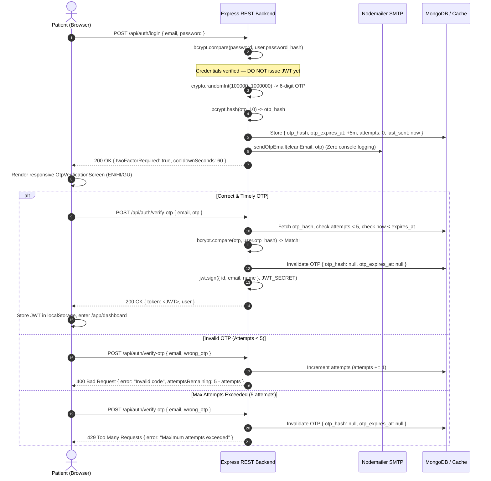

# 🔒 MedGuardian AI — Security & Privacy Architecture

This document outlines the security measures, data privacy practices, and protection mechanisms implemented across MedGuardian AI.

---

## 1. Authentication & Authorization Security

### 1.1 Password Hashing & Salt Rounds
* **Algorithm**: `bcryptjs` one-way salted hashing.
* **Salt Rounds**: 10 rounds of cryptographic salting before database insertion.
* **Plaintext Protection**: Passwords are never logged, echoed, or stored in plaintext. In database queries, user schemas explicitly exclude the password field where appropriate.

### 1.2 Password Complexity Validation
Both the frontend (`src/pages/SignupPage.jsx`) and backend validators enforce strict password requirements:
* Minimum 8 characters.
* At least 1 uppercase letter (`[A-Z]`).
* At least 1 lowercase letter (`[a-z]`).
* At least 1 numeric digit (`[0-9]`).
* At least 1 special character (`[!@#$%^&*...]`).

### 1.3 JWT Token Lifecycle
* **Signing Algorithm**: HMAC SHA-256 (`HS256`).
* **Secret Management**: Stored strictly in environment variables (`JWT_SECRET`).
* **Payload**: Carries minimal non-sensitive identity claims (`{ id: user._id }`).
* **Lifespan**: Configured for 30 days.
* **Client Storage**: Persisted in browser `localStorage`.
* **Transport**: Transmitted securely in HTTP request headers:
  ```http
  Authorization: Bearer <token>
  ```
* **Server Verification**: `authMiddleware.js` extracts the bearer token, verifies its cryptographic signature, checks user existence in MongoDB, and rejects expired or tampered tokens with `401 Unauthorized`.

---

## 2. File Upload Security & PHI Handling

### 2.1 Memory Storage (No Ephemeral File Artifacts)
* Uploaded medical documents are ingested using `multer.memoryStorage()`.
* File bytes are held in volatile RAM buffers during OCR extraction and discarded after processing.
* No patient documents are saved to publicly exposed or persistent server directories.

### 2.2 Payload & Type Validation
* **File Size Ceiling**: Strictly capped at **15MB** (`limits: { fileSize: 15 * 1024 * 1024 }`). Files exceeding this size are rejected with `413 Payload Too Large`.
* **Allowed MIME Types**: Restricted to `application/pdf`, `image/jpeg`, `image/jpg`, and `image/png`.
* **Tamper Prevention**: File extensions and MIME headers are inspected before passing buffers to `pdf-parse`.

### 2.3 SHA-256 Collision & Duplicate Detection
* Before executing resource-intensive OCR or external AI calls, the backend computes a SHA-256 cryptographic digest of the file buffer:
  ```javascript
  const fileHash = crypto.createHash('sha256').update(fileBuffer).digest('hex');
  ```
* If a report with matching hash already exists for the authenticated user, the upload is halted and flagged as a duplicate, preventing duplicate database writes and unnecessary API costs.

---

## 3. Server & Network Hardening

### 3.1 CORS Policy
Express CORS middleware is configured to restrict headers and methods, allowing only authorized cross-origin requests.

### 3.2 Global Error Handling & Stack Trace Shielding
* `errorHandler.js` intercepts all uncaught server exceptions.
* In production mode (`NODE_ENV === 'production'`), error responses return generic, clean JSON error descriptions:
  ```json
  { "error": "Internal server error occurred." }
  ```
* Stack traces, database connection URIs, and internal paths are never leaked to client responses.

---

## 4. API Key & Secret Management

* **Zero Secret Exposure**: Third-party API keys (`GEMINI_API_KEY`, `EMAIL_PASS`, `MONGO_URI`, `JWT_SECRET`) reside exclusively in server-side `.env` files.
* **Client Bundle Isolation**: Client Vite code contains zero references to private server keys. All AI extraction and database operations are mediated through authenticated backend endpoints.
* **Safe Templates**: Both root and server `.env.example` templates provide dummy placeholder values (`your_jwt_secret_here`, `your_gemini_api_key_here`) and are tracked in version control, while `.env` files are ignored in `.gitignore`.

---

## 5. Two-Factor Authentication (2FA) Architecture

> [!IMPORTANT] Implementation Status: Fully Implemented & Cryptographically Verified
> MedGuardian AI implements mandatory Email-Based Two-Factor Authentication (2FA) for all login workflows. No JSON Web Token (JWT) is issued upon primary credential verification; a cryptographically secure OTP challenge must first be satisfied.

### 5.1 Verification Lifecycle & Technical Implementation



### 5.2 Key Cryptographic & Security Safeguards

1. **Cryptographically Secure Entropy**:
   - OTP generation utilizes Node.js `crypto.randomInt(100000, 1000000)` instead of pseudo-random `Math.random()`, ensuring high unpredictability against guessing attacks.
2. **One-Way Hashed Storage (`bcryptjs`)**:
   - Plaintext OTPs are **never stored** in the database or server cache. The server computes `bcrypt.hash(otp, 10)` before storage. Even in the event of an unauthorized database read, the attacker cannot recover the active OTP.
3. **5-Minute Time-To-Live (TTL)**:
   - Verification codes strictly expire 300 seconds after generation (`otp_expires_at`). Expired tokens are purged and rejected with `400 Bad Request`.
4. **Brute-Force & Attempt Throttling**:
   - A strict limit of **5 verification attempts** is enforced per generated code. If 5 incorrect attempts occur, the server immediately destroys the OTP and returns `429 Too Many Requests`.
5. **Resend Cooldown (60 Seconds)**:
   - Repeated requests to `/api/auth/resend-otp` are rate-limited to 1 request per 60 seconds (`otp_last_sent_at`). Calling before cooldown elapses returns `429 Too Many Requests` with the exact remaining seconds.
6. **Previous Code Invalidation**:
   - When a user requests a code resend, the previous OTP is immediately overwritten and invalidated. The old code cannot be used even if delivered late.
7. **Single-Use Destruction (Anti-Replay)**:
   - Upon successful verification, `otp_hash` and `otp_expires_at` are immediately reset to `null`. A verified OTP cannot be replayed.
8. **Strict Zero-Logging Policy**:
   - Raw OTP codes, passwords, and JWTs are never written to server console logs, application log files, or terminal traces.
9. **Emergency SOS Unblocked**:
   - Emergency SOS triggers (`POST /api/sos/trigger`) and national ambulance shortcuts (`tel:108`) rely strictly on established session tokens and require no additional 2FA challenge, ensuring zero friction in life-critical medical emergencies.


